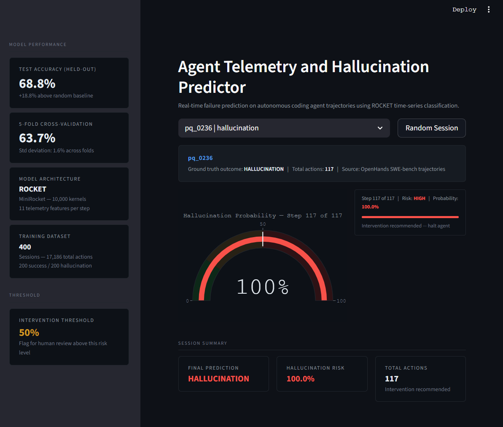

# Agent Trajectory Monitor

Real-time failure prediction for autonomous coding agents using time-series classification on agent execution telemetry.



---

## Overview

Autonomous coding agents — SWE-agent, OpenHands, AutoGPT, Claude Code — fail in characteristic ways. They enter infinite bash loops, repeat the same failed command dozens of times, hallucinate file paths, or spiral into increasingly verbose reasoning while making zero progress. These failures waste compute, mislead users, and erode trust in agentic systems.

This project instruments agent execution at the trajectory level and predicts failure events before they manifest. The system ingests raw agent logs, extracts time-series behavioral features at every step, and applies a ROCKET multivariate classifier to surface high-risk sessions in real time.

The output is a deployable monitoring layer that flags hallucinating agents in production and recommends human intervention before further compute is wasted.

---

## Results

Trained and evaluated on 400 real OpenHands SWE-bench trajectories totaling 17,186 individual agent actions.

| Metric | Score |
|---|---|
| Test Accuracy (held-out 20%) | **68.8%** |
| 5-Fold Cross-Validation | **63.7% ± 1.6%** |
| Hallucination Recall | **72%** |
| Random Baseline | 50.0% |
| Improvement over baseline | **+18.8%** |

The model favors recall on hallucination detection — catching most failures at the cost of occasional false positives. This trade-off is intentional for a circuit-breaker use case where missing a failure is more costly than interrupting a successful run.

---

## How It Works

```
Raw Agent Logs (Parquet/JSON)
            │
            ▼
  Ingestion & Normalization     ── parses SWE-bench / OpenHands trajectories
            │                       into a unified SQLite schema
            ▼
  Per-Step Feature Engineering  ── 11 behavioral signals computed across
            │                       a sliding window of agent actions
            ▼
  ROCKET MiniRocket Classifier  ── 10,000 random convolutional kernels
            │                       on multivariate time-series input
            ▼
  Real-Time Risk Scoring        ── streaming prediction at each agent step
            │
            ▼
  Streamlit Monitoring Dashboard
```

### Telemetry Features Captured Per Agent Action

| Feature | Signal Captured |
|---|---|
| `time_since_last_action` | Detects bursty looping behavior |
| `reasoning_length` | Tracks rambling or frantic generation |
| `semantic_similarity` | Measures repetition in agent reasoning |
| `error_keywords` | Counts traceback and failure indicators |
| `is_repeat_command` | Flags command-level loops |
| `error_rate_roll` | Rolling 5-step error rate |
| `repeat_rate_roll` | Rolling 5-step command repetition |
| `semantic_drift_roll` | Rolling reasoning drift |
| `reasoning_zscore` | Verbosity outlier detection |
| `time_accel` | Acceleration in action cadence |
| `action_entropy` | Diversity of action types |

### Why ROCKET

Standard ML on tabular agent logs loses the temporal structure that makes failure detectable in the first place. A successful agent and a failing agent often look statistically similar in any single snapshot — the difference emerges in the *shape* of their trajectories over time.

ROCKET (Random Convolutional Kernel Transform) is purpose-built for multivariate time-series classification. It applies thousands of random convolutional kernels to extract patterns at multiple time scales, then trains a linear classifier on the transformed features. MiniRocket — the variant used here — is the fastest variant and runs entirely on CPU.

---

## Tech Stack

**Data Pipeline:** Python, Pandas, PyArrow, SQLite3
**Machine Learning:** sktime (MiniRocket), scikit-learn, NumPy
**Dashboard:** Streamlit, Plotly
**AI-Assisted Development:** Claude Code, Google Gemini

This project was built end-to-end using AI development tools as a core part of the engineering workflow. Claude Code drove iterative architecture design, feature engineering decisions, and dashboard implementation. Google Gemini supported research synthesis on ROCKET methodology, time-series classification trade-offs, and SWE-bench trajectory parsing. Every line of code was reviewed and refined manually before commit — the AI tools acted as accelerators, not authors.

---

## Quick Start

### 1. Clone the repository

```bash
git clone https://github.com/Dinesh-Kumaralingam/agent-trajectory-monitor.git
cd agent-trajectory-monitor
```

### 2. Create a virtual environment

```bash
python -m venv venv
source venv/bin/activate           # macOS / Linux
.\venv\Scripts\activate            # Windows
```

### 3. Install dependencies

```bash
pip install -r requirements.txt
```

### 4. Download trajectory data

Raw trajectory data is excluded from the repo to keep it lightweight. Download an evaluation dataset from Hugging Face — for example the SWE-bench OpenHands trajectories — and place the files into the `data/` directory:

- Parquet files → `data/raw_trajectories.parquet`
- Raw JSON `.traj` files → `data/raw_trajectories/*.traj`

### 5. Run the pipeline

```bash
# Step 1 — Parse logs into SQLite
python data/ingest_parquet.py     # for parquet sources
python data/ingest_swe.py         # for JSON .traj files

# Step 2 — Train the ROCKET classifier
python models/rocket.py

# Step 3 — Launch the dashboard
streamlit run dashboard/app.py
```

The dashboard streams predictions step-by-step against historical sessions, showing hallucination probability evolving in real time as the agent's trajectory unfolds.

---

## Project Structure

```
agent-trajectory-monitor/
├── assets/
│   └── dashboard.png          # Dashboard preview screenshot
├── data/
│   ├── ingest_parquet.py      # Parquet ingestion pipeline
│   ├── ingest_swe.py          # Raw .traj ingestion pipeline
│   └── telemetry.db           # SQLite store (generated)
├── models/
│   ├── rocket.py              # Feature engineering + ROCKET training
│   └── rocket_model.pkl       # Trained model artifact (generated)
├── dashboard/
│   └── app.py                 # Streamlit monitoring UI
├── requirements.txt
├── .gitignore
└── README.md
```

---

## Roadmap

- **Live agent interception** — proxy layer that halts running agents when failure probability crosses an intervention threshold
- **Early warning calibration** — quantify how many steps in advance the model predicts failure on average
- **Sentence-transformer embeddings** — replace cosine similarity proxy with proper semantic drift measurement using transformer-based embeddings
- **Multi-class failure taxonomy** — distinguish loops, hallucinations, silent fails, and infrastructure timeouts as separate classes
- **Online learning** — continuous retraining as new trajectory data arrives from production agents

---

## License

MIT

---

## Acknowledgements

Trajectory data sourced from the SWE-bench evaluation suite and OpenHands public agent traces. ROCKET methodology from Dempster, Petitjean, and Webb (2020). Built using sktime, Streamlit, and Plotly.
